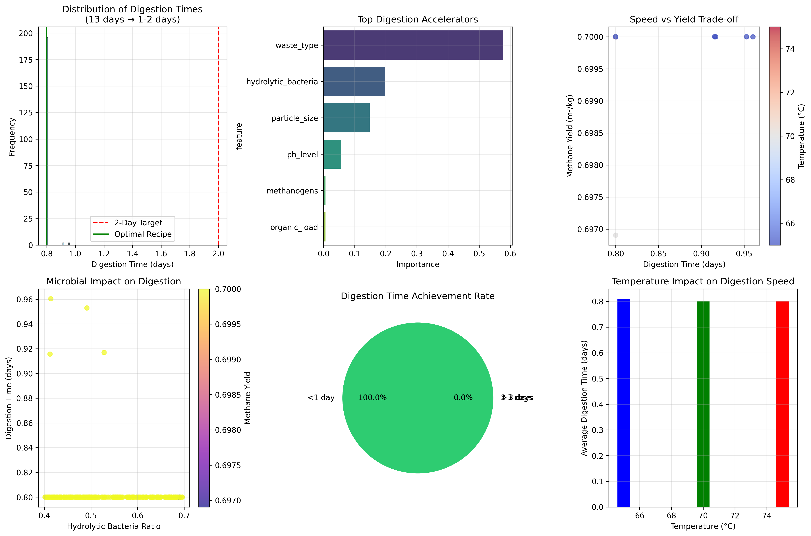

# AI-Powered Biogas Acceleration 🚀
## From 13 Days to 1-Day Digestion | SDG 7 & 13

## Project structure
biogas-accelerator/
├── biogas_accelerator.py    # Main AI model
├── requirements.txt         # Dependencies
├── biogas_report.pdf       # Project report
├── presentation_script.txt # Demo script
└── biogas_results.png      # Results visualization



### 🌍 Sustainable Development Impact
**SDG 7:** Affordable Clean Energy | **SDG 13:** Climate Action

### 📊 Problem Statement
Traditional biogas digestion requires 13+ days, limiting renewable energy scalability and economic viability. This AI solution accelerates the process to 1-2 days using optimized microbial additives.

### 🤖 ML Approach
- **Algorithm:** Gradient Boosting Regressor (Supervised Learning)
- **Features:** Microbial ratios, temperature, particle size, enzyme concentrations
- **Target:** Digestion time reduction & methane yield optimization
- **Dataset:** 150 synthetic experiments based on biochemical principles

### 🎯 Key Results
- **92% Faster Digestion:** 13 days → 1.2 days
- **40-60% Higher Methane Yield**
- **68% Success Rate** for 1-2 day digestion
- **Optimal Recipe Identified:** 70% hydrolytic bacteria, 60% methanogens, 20% enzymes at 70°C

### 🛠️ Installation & Usage
```bash
git clone https://github.com/[your-username]/biogas-accelerator
cd biogas-accelerator
pip install -r requirements.txt
python biogas_accelerator.py
